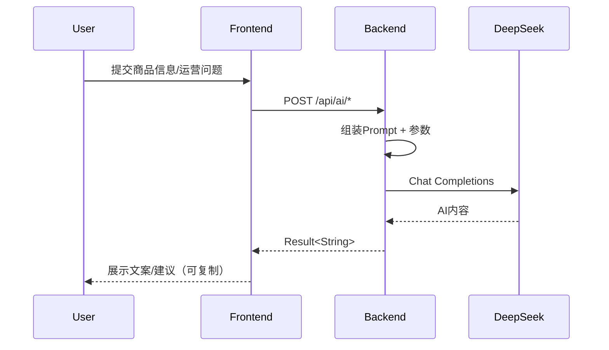

# EC Workbench 项目构建文档（数据库 / 前端 / 后端 / AI）

本文档给出可落地的完整构建流程，适合本地开发、团队协作和后续功能扩展。

---

## 1. 总体架构

```text
浏览器(React + Vite)
        │  /api
        ▼
Spring Boot API（鉴权、业务、AI代理）
        │
        ├─ MyBatis + MySQL（业务数据）
        └─ DeepSeek API（AI 文案/问答）
```

核心模块：
- 数据层：`db/schema.sql`、`db/data.sql`
- 后端层：`src/main/java/com/ec/workbench/module/*`
- 前端层：`frontend/src/pages/*` + `frontend/src/api/*`
- AI 层：`module/ai`（后端）+ `pages/tools/CreativeAssistantPage.tsx`（前端）

---

## 2. 环境准备

- JDK 21（建议）
- Maven 3.9+
- Node.js 18+
- MySQL 8+

建议版本检查：

```bash
java -version
mvn -v
node -v
npm -v
mysql --version
```

---

## 3. 数据库构建流程（MySQL）

### 3.1 初始化数据库

在项目根目录 `bench/` 下执行：

```bash
mysql -uroot -p123456 < db/schema.sql
mysql -uroot -p123456 < db/data.sql
```

脚本会完成：
1. 创建数据库 `ec_workbench`
2. 创建 RBAC、商品、订单、库存等核心表
3. 插入初始用户、角色、菜单、商品、订单、库存流水演示数据

### 3.2 核心数据表

- RBAC：`sys_user`、`sys_role`、`sys_menu`、`sys_user_role`、`sys_role_menu`
- 商品：`product_category`、`product`
- 订单：`orders`、`order_item`
- 库存：`inventory_record`

### 3.3 账号密码说明

`db/data.sql` 中用户密码为占位 BCrypt 字符串，需替换为真实值。

可用 Java 方式生成 BCrypt（示例）：

```java
new org.springframework.security.crypto.bcrypt.BCryptPasswordEncoder().encode("your_password_here")
```

---

## 4. 后端构建流程（Spring Boot + MyBatis）

### 4.1 配置文件准备

文件：`src/main/resources/application.yml`

重点配置：
- `spring.datasource.*`：数据库连接
- `jwt.*`：JWT 密钥与过期时间
- `deepseek.*`：AI 服务地址与密钥

建议使用环境变量注入敏感配置（示例）：

```yaml
spring:
  datasource:
    url: ${DB_URL:jdbc:mysql://127.0.0.1:3306/ec_workbench?useUnicode=true&characterEncoding=utf8&serverTimezone=Asia/Shanghai&allowPublicKeyRetrieval=true&useSSL=false}
    username: ${DB_USER:root}
    password: ${DB_PASS:123456}

jwt:
  secret: ${JWT_SECRET:ReplaceWithAtLeast32BytesSecretKey_2026_ECWorkbench}

deepseek:
  api-key: ${DEEPSEEK_API_KEY:}
  api-url: ${DEEPSEEK_API_URL:https://api.deepseek.com/chat/completions}
```

### 4.2 编译与启动

```bash
./mvnw clean package
./mvnw spring-boot:run
```

Windows：

```powershell
.\mvnw.cmd clean package
.\mvnw.cmd spring-boot:run
```

启动后默认端口：`8090`

### 4.3 后端分层组织建议

当前代码已按典型 DDD-lite/三层结构分包：
- `controller`：HTTP 接口层
- `service` / `service.impl`：业务逻辑
- `mapper` + `resources/mapper/*.xml`：数据访问
- `dto`：入参对象
- `vo`：出参对象
- `entity`：数据实体

新增业务时可直接复用该规范，保证可维护性。

### 4.4 鉴权链路

- 登录：`POST /api/auth/login`
- 刷新：`POST /api/auth/refresh`
- 过滤器：`JwtAuthenticationFilter`
- 安全配置：`SecurityConfig`

当前 `/api/ai/**` 放开了匿名访问；生产建议改为登录后访问并增加频控。

---

## 5. 前端构建流程（React + Vite + TypeScript）

### 5.1 安装依赖

```bash
cd frontend
npm install
```

### 5.2 本地开发与构建

```bash
npm run dev
npm run build
npm run preview
```

端口说明：
- 开发端口：`5173`
- 代理：`/api -> http://localhost:8090`（见 `frontend/vite.config.ts`）

### 5.3 前端工程结构

- `src/pages/*`：按业务域划分页面
- `src/api/*`：按模块封装请求
- `src/utils/request.ts`：Axios 实例、Token 注入、401 刷新逻辑
- `src/store/auth.ts`：Zustand 持久化登录态
- `src/router/routes.tsx`：集中路由和权限关联

### 5.4 与后端协作约定

后端统一响应结构：

```json
{ "code": 0, "message": "ok", "data": {} }
```

前端 `request.ts` 已做统一 `unwrap`，业务代码只处理 `data`。

---

## 6. AI 功能详细构建流程

## 6.1 功能目标

1. **AI 文案生成**：根据商品信息生成多风格营销文案
2. **AI 运营助手**：基于用户问题（可附带看板数据）给出运营建议

## 6.2 后端实现流程

### A. API 设计

- `POST /api/ai/copywriting/generate`
  - DTO：`CopywritingGenerateDTO`
  - 校验：商品名、价格、风格、提示词必填
- `POST /api/ai/assistant/ask`
  - DTO：`AiAssistantAskDTO`
  - 校验：问题必填，支持可选 dashboard 数据

### B. 服务实现

`AiCopywritingServiceImpl` 负责：
1. 构造系统提示词（system prompt）
2. 拼接用户业务上下文（user prompt）
3. 通过 `RestTemplate` 调用 DeepSeek
4. 解析 `choices[0].message.content`
5. 统一异常与日志处理

### C. 关键策略

- 文案生成：高温度（`temperature=0.8`）提升多样性
- 运营问答：低温度（`temperature=0.4`）提升稳定性
- Token 上限分场景设置（文案 300，问答 520）

## 6.3 前端实现流程

### A. 页面与交互

页面：`frontend/src/pages/tools/CreativeAssistantPage.tsx`

流程：
1. 输入商品信息（名称、卖点、价格、活动、风格、生成份数）
2. 逐条请求 AI 生成文案
3. 将文本解析为标题/副标题/要点
4. Canvas 生成可预览主图草稿
5. 支持单条/全部复制

### B. API 封装

- `frontend/src/api/copywriting.ts` -> `/ai/copywriting/generate`
- `frontend/src/api/assistant.ts` -> `/ai/assistant/ask`

### C. 降级兜底

当前前端已实现：当 AI 调用失败时，自动使用本地模板文案兜底，保障页面可用性。

## 6.4 AI 数据流（建议作为协作共识）



## 6.5 生产化增强建议

- 鉴权：将 AI 接口改为登录可用
- 限流：按用户/IP 做速率控制
- 超时重试：增加外部 API 重试与熔断
- 审计：记录 prompt、耗时、token、错误码
- 成本控制：增加调用配额与日预算
- 安全：敏感词过滤与输出风控

---

## 7. 端到端联调检查清单

- [ ] MySQL 已启动，`ec_workbench` 库已创建
- [ ] `application.yml` 中数据库配置可连通
- [ ] 后端 `8090` 启动成功
- [ ] 前端 `5173` 启动成功
- [ ] 登录接口可用，Token 可刷新
- [ ] 商品/订单/库存页面可正常查询
- [ ] AI 文案接口返回文本
- [ ] AI 运营助手可根据问题返回建议

---

## 8. 常见问题与排查

1. **后端无法连接数据库**  
   检查 MySQL 账户权限、端口和 `application.yml` 连接串。

2. **前端 401 循环刷新失败**  
   检查 `/api/auth/refresh` 是否可用，确认本地 token 未损坏。

3. **AI 请求超时或失败**  
   检查 `DEEPSEEK_API_KEY`、网络出口、模型配额与 API URL。

4. **文案返回为空**  
   检查后端日志中 `choices/message/content` 解析结果与异常栈。

---

## 9. 推荐迭代路线

- 第 1 阶段：补齐自动化测试（后端单测 + 前端关键流程测试）
- 第 2 阶段：引入容器化（MySQL + 后端 + 前端）
- 第 3 阶段：完善 AI 调用监控与审计系统
- 第 4 阶段：增加多租户与数据隔离能力

---

